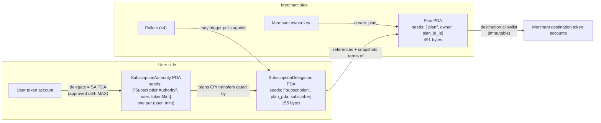

# Accounts & PDAs

**BLUF:** Three program-derived accounts carry all state: the **SubscriptionAuthority** (the program's signing arm over a user's tokens), the **Plan** (a merchant's published offer), and the **SubscriptionDelegation** (one user's binding to one plan, with a snapshot of the terms they agreed to). Get the seeds right and everything else is derivable client-side.

## The three PDAs at a glance

| PDA | Seeds | Size | Created by | Closed by |
|---|---|---|---|---|
| **SubscriptionAuthority** | `["SubscriptionAuthority", user, tokenMint]` | — (signer PDA; see program source) | Delegator, once per (user, mint) (`initSubscriptionAuthority`) | Delegator (`closeSubscriptionAuthority`) |
| **Plan** | `["plan", owner, plan_id_le]` | 491 bytes (`PLAN_SIZE`) | Merchant (`create_plan`) | Merchant (`delete_plan`) |
| **SubscriptionDelegation** | `["subscription", plan_pda, subscriber]` | 155 bytes | Subscriber (`subscribe`) | Subscriber (`cancel_subscription`; see lifecycle notes) |

Note `plan_id_le` — the plan ID is encoded **little-endian** in the seed. Derivation bugs here are a classic first-hour integration failure. And note the SubscriptionAuthority seed string: it is the literal **CamelCase** `"SubscriptionAuthority"` (the SDK exports it as `SUBSCRIPTION_AUTHORITY_SEED`) — the one seed in the program that isn't lowercase. Don't normalize it to `subscription_authority` from habit; the derivation will silently miss.

## How they relate

## SubscriptionAuthority — the program's signing arm

- Seeds: `["SubscriptionAuthority", user, tokenMint]` — literal CamelCase seed string, derived per **(user, mint)** pair, not per user.
- Becomes the **single token-account delegate** on the user's token account for that mint, approved for `u64::MAX`. (Why that's safe — and why your wallet might disagree — is covered in [The Authorization Model](authorization-model.md).)
- It holds no policy itself. It's a pure signer: every transfer it signs is gated by a Delegation PDA's checks first.
- One delegate slot per SPL token account is the constraint that forces this design — the SA PDA multiplexes many delegations on that mint through that one slot.

## Plan — the merchant's published offer

- Seeds: `["plan", owner, plan_id_le]`; size exactly **491 bytes** (the SDK exports `PLAN_SIZE = 491`: discriminator 1 + owner 32 + bump 1 + status 1 + plan data 456).
- **Immutable after creation:** `amount`, `period`, `mint`, `destinations`. These are the billing terms a subscriber agrees to, and they cannot be edited — ever.
- **Updatable** (via `update_plan`): `status`, `end_ts`, `pullers` (max 4), `metadata_uri`.
- The destination allowlist being immutable has real operational teeth: rotating your treasury means sunsetting the plan and asking subscribers to re-subscribe to a new one. Plan for that before you pick destination accounts.

## SubscriptionDelegation — one user, one plan, terms frozen

The 155-byte layout, as shipped:

| Region | Size | What it holds |
|---|---|---|
| Header | 107 bytes | Account header / identity fields |
| Terms snapshot | 24 bytes | The plan's billing terms as they were **at subscribe time** |
| `amount_pulled_in_period` | `u64` (8) | Running total pulled in the current period |
| `current_period_start_ts` | `i64` (8) | When the current period began (rolled forward lazily, at transfer time) |
| `expires_at_ts` | `i64` (8) | Expiry timestamp; `0` = active |

The **terms snapshot** is the load-bearing field. At every pull, `check_plan_terms()` compares the snapshot (including the plan's `created_at`) against the live plan account. If a merchant deletes a plan and recreates a different one at the same address, the fingerprint won't match and the pull fails with `PlanTermsMismatch` — the [ghost-account defense](../reference/failure-modes.md).

## Lifecycle & rent notes

- All three accounts follow standard Solana rent-exemption semantics: creation requires the rent-exempt deposit; closing an account (`closeSubscriptionAuthority`, `delete_plan`) reclaims it.
- The two counters (`amount_pulled_in_period`, `current_period_start_ts`) are **only updated when a transfer executes** — there is no crank ticking periods forward. A subscription that's never pulled just sits there with stale period state, and rolls forward the next time someone pulls. This matters for [puller scheduling](../guides/running-a-puller.md).
- `expires_at_ts = 0` means active/no expiry; a nonzero value is checked at transfer time like every other gate.
- Cancellation does **not** destroy the SubscriptionDelegation — the existence of `resume_subscription` tells you the account survives a cancel; pulls are simply refused while cancelled.

**Recap:** SA PDA = who signs, Plan = what was offered, SubscriptionDelegation = what one user actually agreed to (frozen) plus the live per-period counters. All state needed to validate a pull lives in those three accounts.

---

*Sources for every claim on this page: [About → Sources](../about.md#sources).*
