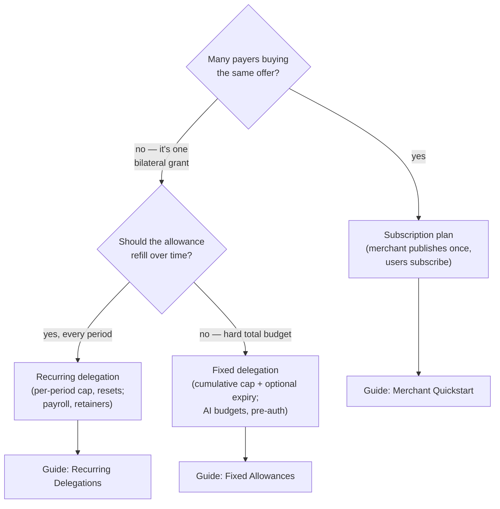

# The Three Primitives

**BLUF:** The program ships three delegation shapes. **Fixed** = a cumulative budget that only goes down (AI agents, pre-auth). **Recurring** = a cap that resets every period (payroll, contractors). **Plan** = a merchant-published recurring offer that many users subscribe to, with their terms snapshotted at subscribe time (consumer subscriptions). Pick by asking: *one payer or many? does the allowance refill?*

## Comparison table

| | Fixed delegation | Recurring delegation | Subscription plan |
|---|---|---|---|
| **Shape** | One payer → one counterparty | One payer → one counterparty | One merchant offer → many subscribers |
| **Spending limit** | **Cumulative cap** — total ever spendable | **Per-period cap** — resets each period | Plan `amount` per period, snapshotted per subscriber |
| **Refills?** | Never | Every period (use it or lose it — unspent capacity does not accumulate) | Every period |
| **Period unit** | n/a | **Seconds** (`periodLengthS`) | Hours (`periodHours`), `1..8760` |
| **Expiry** | Optional | Overall expiry | Plan `end_ts`; delegation `expires_at_ts` |
| **Who defines terms** | The payer (delegator) | The payer (delegator) | The **merchant** — subscriber accepts by subscribing |
| **Terms changeable?** | Revoke & recreate | Revoke & recreate | Core terms (`amount`/`period`/`mint`/`destinations`) **immutable**; only `status`/`end_ts`/`pullers`/`metadata_uri` updatable |
| **Set up by** | `createFixedDelegation` | `createRecurringDelegation` | `create_plan` (merchant) + `subscribe` (user) |
| **Pulled via** | `transferFixed` | `transferRecurring` | `transfer_subscription` (owner or ≤4 whitelisted pullers) |
| **Killed by** | `revokeDelegation` | `revokeDelegation` | `cancel_subscription` (user) / `delete_plan` (merchant) |
| **Canonical use** | AI-agent budget, card-style pre-auth | Payroll, contractor retainer | SaaS / consumer subscriptions |

## When to use which

A subtlety worth stating plainly: a **plan is not just "a recurring delegation with marketing."** The plan adds three things — many-to-one fan-out, the **terms snapshot** (each subscriber is protected against the merchant editing the deal after the fact), and the **puller whitelist** (delegating collection to infrastructure that isn't the merchant's hot key).

## Feel the period mechanics

Recurring semantics trip up more integrators than anything else: the cap resets per period, and the rollover happens **lazily at transfer time** — there's no crank. (The simulator below uses hours as its display unit; remember the actual on-chain unit is **seconds** for direct recurring delegations and **whole hours** for plans.) Play with it:

interactive — period &amp; cap simulator (recurring semantics)

<strong>Static view (enable JavaScript for the simulator):</strong> with a 24-hour
period and a 100-unit cap, pulls of 40 units every 10 hours land at t=0h ✓ (40/100),
t=10h ✓ (80/100), t=20h ✗ (would be 120/100 — <em>cap exceeded, pull rejected</em>),
t=30h ✓ (new period — counter reset to 0, now 40/100), and so on. Unspent capacity
from one period never carries into the next.

Three behaviors to internalize from the simulator:

1. **The cap is per-period, not lifetime** — set period to 24h and watch the counter reset at every band boundary.
2. **No carry-over.** If a period goes underused, that capacity is gone. Recurring is "use it or lose it" by design.
3. **Rollover is lazy.** On chain, the reset happens *inside the next pull*, not at the boundary itself. Nothing updates the account at midnight — which is exactly why [your puller's schedule](../guides/running-a-puller.md) is what makes billing actually feel periodic.

!!! note "Granularity floor — plans only"
    **Plan** periods are whole **hours** (`periodHours`, `1` to `8760` — one hour to one year). But that floor is a plan-layer constraint, not a program-wide one: **direct recurring delegations take their period in seconds** (`periodLengthS` in the SDK), so per-minute — even per-second — metering is possible if you use a bilateral recurring delegation instead of a merchant-published plan. If you need streaming-style payments, drop down a layer; don't reach for a plan.

**Recap:** fixed = budget that only depletes; recurring = budget that refills each period with no carry-over; plan = recurring, productized for many subscribers with snapshot protection. Decision rule: many payers → plan; refilling → recurring; hard total → fixed.

---

*Sources for every claim on this page: [About → Sources](../about.md#sources).*
