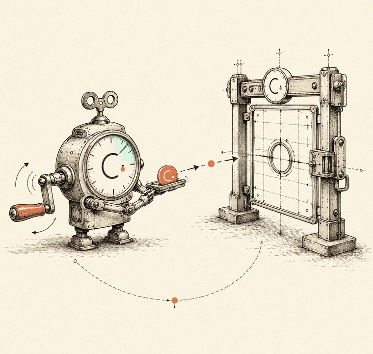

# Running a Puller

**BLUF:** The program is a validator, not a scheduler — it will check every pull against caps, terms, and cancellations, but it will never *initiate* one. If you're a merchant, **you are the billing daemon now.** This page is the operations manual nobody else writes: scheduling against lazy period rollover, retry classification, fee economics, the puller whitelist, event-driven monitoring, and the edge cases that bite at period boundaries.

!!! note "Program fact vs. our recommendation"
    On this page, program behavior (what the chain enforces) is stated as fact and traces to the [sources](../about.md#sources). Operational practice — schedules, retries, monitoring shapes — is **engineering recommendation** from first principles, marked as such. The program doesn't care how you run your puller; your revenue does.

## Why this page exists

{ width=300 align=right }


There is **no native scheduler, crank, or keeper** in the program. On-chain you get validation only; the trigger is an off-chain transaction someone must submit, sign, and pay for. And the ecosystem hole is real: **Clockwork — the keeper network that would have been the obvious answer — is dead**, and as of this writing the gap is unfilled. No general-purpose decentralized cron has replaced it.

So the honest integration picture is: *the subscriptions program solves authorization; execution is still your problem.* (Anyone telling you this program "replaces Clockwork" has it backwards — see [misconceptions](../index.md).)

<div class="cdo-figure">
<svg class="dgm" viewBox="0 0 900 420" role="img" xmlns="http://www.w3.org/2000/svg" aria-label="Lifecycle of one pull: the off-chain puller submits transferSubscription; the program validates the gate chain, rolls the period and updates counters, signs a token-program CPI as the SubscriptionAuthority PDA to move tokens to the plan destination, and emits a SubscriptionTransferEvent the puller can monitor.">
<defs>
  <marker id="cdoArr" viewBox="0 0 10 10" refX="8.5" refY="5" markerWidth="7" markerHeight="7" orient="auto-start-reverse"><path d="M0 0 L10 5 L0 10 z" fill="#211e1a"/></marker>
  <marker id="cdoArrC" viewBox="0 0 10 10" refX="8.5" refY="5" markerWidth="7" markerHeight="7" orient="auto-start-reverse"><path d="M0 0 L10 5 L0 10 z" fill="#c05f3f"/></marker>
  <style>
    .dgm .b{fill:#fafaf7;stroke:#211e1a;stroke-width:2.5}
    .dgm .hd{fill:#fff;stroke:#211e1a;stroke-width:2.5}
    .dgm .t{font-family:Inter,system-ui,sans-serif;font-size:14px;font-weight:600;fill:#211e1a}
    .dgm .s{font-family:Inter,system-ui,sans-serif;font-size:11.5px;fill:#58524a}
    .dgm .sm{font-family:'JetBrains Mono',ui-monospace,monospace;font-size:10px;fill:#58524a}
    .dgm .lbl{font-family:'JetBrains Mono',ui-monospace,monospace;font-size:10.5px;fill:#c05f3f;letter-spacing:.03em}
    .dgm .life{stroke:#211e1a;stroke-opacity:.28;stroke-width:1.5;stroke-dasharray:2 7}
    .dgm .ln{stroke:#211e1a;stroke-width:2;fill:none}
    .dgm .lnc{stroke:#c05f3f;stroke-width:2;fill:none}
  </style>
</defs>
  <line class="life" x1="130" y1="92" x2="130" y2="404"/>
  <line class="life" x1="450" y1="92" x2="450" y2="404"/>
  <line class="life" x1="770" y1="92" x2="770" y2="404"/>
  <rect class="hd" x="55" y="44" width="150" height="46" rx="9"/>
  <text x="130" y="65" text-anchor="middle" class="t">Puller</text>
  <text x="130" y="82" text-anchor="middle" class="s">off-chain daemon</text>
  <rect class="hd" x="355" y="44" width="190" height="46" rx="9"/>
  <text x="450" y="71" text-anchor="middle" class="t">Subscriptions program</text>
  <rect class="hd" x="680" y="44" width="180" height="46" rx="9"/>
  <text x="770" y="71" text-anchor="middle" class="t">Token program</text>
  <line class="ln" x1="132" y1="124" x2="448" y2="124" marker-end="url(#cdoArr)"/>
  <text x="290" y="116" text-anchor="middle" class="lbl">transferSubscription() · pays the fee</text>
  <rect class="b" x="300" y="146" width="300" height="42" rx="8"/>
  <text x="450" y="164" text-anchor="middle" class="sm">validate the gate chain —</text>
  <text x="450" y="180" text-anchor="middle" class="sm">cap · destination · expiry · terms · cancellation</text>
  <rect class="b" x="330" y="200" width="240" height="34" rx="8"/>
  <text x="450" y="221" text-anchor="middle" class="sm">roll period · update counters (atomic)</text>
  <line class="lnc" x1="452" y1="264" x2="768" y2="264" marker-end="url(#cdoArrC)"/>
  <text x="610" y="256" text-anchor="middle" class="lbl">transfer CPI — signed by the SA PDA</text>
  <rect class="b" x="650" y="286" width="215" height="44" rx="8"/>
  <text x="757" y="304" text-anchor="middle" class="sm">moves tokens →</text>
  <text x="757" y="320" text-anchor="middle" class="sm">the plan's destination only</text>
  <line class="lnc" x1="448" y1="362" x2="132" y2="362" marker-end="url(#cdoArrC)" stroke-dasharray="5 4"/>
  <text x="290" y="354" text-anchor="middle" class="lbl">SubscriptionTransferEvent (self-CPI) → monitor</text>
</svg>
<p class="cdo-figcaption">The lifecycle of one pull. The program validates and signs; you supply the transaction. If any gate fails, the whole transaction reverts.</p>
</div>

## Who can pull, and the whitelist mechanics

Program facts:

- Pulls (`transfer_subscription`) may be signed by the **plan owner** or by one of **at most 4 whitelisted pullers** per plan.
- The puller list **is updatable** via `update_plan` (unlike `destinations`, which are immutable forever).
- The **caller pays** the transaction fee on every pull — roughly **5,000 lamports per pull** at the base fee.

Operational consequences (recommendations):

- **Don't pull with your plan-owner key.** It's your most powerful key (it can `update_plan` and `delete_plan`); it shouldn't live on a billing server. Whitelist dedicated puller keys and keep the owner key cold.
- **Budget the 4 slots deliberately.** A sane split: two hot keys for your own infra (active + standby), one for a third-party billing provider if you use one, one spare. Rotation is possible (the list is updatable) but it's an on-chain `update_plan` signed by the owner — so a leaked puller key is recoverable, just not instant. Treat puller keys as semi-hot: low SOL balances, monitored, rotated on schedule.
- **Remember what's *not* rotatable:** if your *destination* treasury is compromised, no puller change saves you — destinations are immutable, and recovery means sunsetting the plan and re-subscribing everyone. Design your treasury accordingly *before* `create_plan`.

## Scheduling around period boundaries

Program facts that drive the schedule:

- Periods are fixed windows in whole hours, anchored at the subscription's `current_period_start_ts` — **not** calendar-aligned.
- Rollover is **lazy**: the period counter resets *inside the next successful-or-attempted pull*, not at the boundary. Nothing happens on-chain at the boundary itself.
- Each subscriber's boundary is their own — a plan with 10,000 subscribers has up to 10,000 distinct period clocks, each anchored at subscribe time.

Recommended schedule design:

1. **Index per-subscriber due times.** Maintain a table of `(subscription_pda, current_period_start_ts, period_hours)` from your event index, and compute `next_due = current_period_start_ts + period_hours * 3600`. Don't poll every subscription account every minute; schedule from the index.
2. **Pull shortly *after* the boundary, with jitter.** Firing exactly at the boundary invites clock-skew rejections (your clock vs. the cluster clock). A few minutes of buffer plus randomized jitter also smooths your own load when many subscribers cluster.
3. **Trust the chain's clock, not yours.** The program evaluates boundaries against on-chain time at execution. Your scheduler's timestamp is a hint; the authoritative answer is whether the pull lands. A pull that's a hair early simply fails the cap check — see retries below.
4. **Late is mostly fine; very late wastes money differently per primitive.** For plans/recurring there's no carry-over: skip a whole period and that revenue/allowance is gone, but the next period is unaffected. Your SLA is with your own revenue.

## Retry strategy

Recommended classification — split failures into **permanent** (retrying burns fees for nothing) and **transient** (retry with backoff):

| Class | Examples | Handling |
|---|---|---|
| **Permanent for this period** | Per-period cap already consumed (e.g., you double-pulled) | Do nothing; schedule next period |
| **Permanent until human/state change** | Subscription cancelled; plan expired (`end_ts`); `PlanTermsMismatch`; subscriber's token account lacks balance | Stop retrying. Route to dunning/lifecycle handling — see [Failure Modes](../reference/failure-modes.md) |
| **Transient** | RPC errors, blockhash expiry, network congestion, fee spikes | Exponential backoff with a retry cap (e.g., 5 attempts over ~1h), then alert |

Two recommendations that save real money:

- **Simulate before sending** (`simulateTransaction`) when in doubt — a simulation that fails the cancellation or cap gate costs you nothing, while a submitted failing transaction still pays its fee.
- **Distinguish "insufficient subscriber balance" as its own lane.** It's the one permanent-ish failure that *self-heals* (the user tops up). A classic dunning ladder — retry at +6h, +24h, +72h, then mark delinquent and cut service — maps cleanly onto it.

## Fee economics

- The base cost is **~5,000 lamports per pull, paid by the puller** (program fact). At 10,000 subscribers billed monthly, that's ~50M lamports = 0.05 SOL/month at base fees — rounding error for most businesses, but **nonzero and yours**, not the subscriber's.
- Failed transactions that reach execution still pay fees — another reason to simulate first and classify permanent failures instead of blind-retrying (recommendation).
- Under congestion you'll want priority fees on top of the base fee; that's standard Solana practice, sized to how time-sensitive a pull really is (recommendation — for billing, usually "not very": waiting an hour is cheaper than bidding for the next slot).
- Keep puller keys funded but lean: enough SOL for a billing cycle plus retries, low enough that a leaked key is an annoyance, not an incident (recommendation).

## Monitoring: build on the four events

The program emits four events via self-CPI (signed with the `["event_authority"]` PDA): **Created, Cancelled, Resumed, Transfer**. Your puller should be a consumer of all four (full handling table on the [Events page](../reference/events.md)):

- **Created** → add the subscriber to the schedule index; provision access.
- **Cancelled** → remove from the schedule *immediately* — every pull you fire at a cancelled subscription is a guaranteed-failed transaction.
- **Resumed** → re-add to the schedule; re-establish the due time from the account state.
- **Transfer** → the ground truth of revenue. Reconcile every expected pull against an observed Transfer event; the *absence* of one is your alert condition.

Recommended invariant check (cheap and brutal): every period, `count(expected pulls) - count(Transfer events) = 0`. Anything else pages a human.

## Idempotency & period-rollover edge cases

These are the cases that look fine in testing and bite in production (recommendations built on program facts):

- **Duplicate pull in the same period.** If your scheduler double-fires and the pull amount equals the period cap, the second pull fails the cap check — **the cap is your idempotency backstop**. But don't lean on it as your only guard: deduplicate in your own job queue too, because a duplicate is still a paid, failed transaction.
- **Pull racing the boundary.** Two pulls straddling a rollover can *both* succeed legitimately — one consumes the old period's remaining cap, the next lands in the fresh period. That's correct program behavior, but it looks like a double-charge to a customer if your schedule drifted. Anchor your schedule to `current_period_start_ts` read from chain state, not to "when we last pulled."
- **First pull timing.** A subscription's period clock starts at subscribe time. Decide your product semantics — bill immediately at subscribe (pull right after `Created`), or at the end of the first period — and encode it; the program supports either, it just enforces the cap window.
- **Stale local state after downtime.** If your puller was down for a day, recompute due times from on-chain account state and your event index — never replay a queued backlog blindly. No-carry-over semantics mean a fully missed period is simply gone; firing three "catch-up" pulls produces one success and two paid failures.
- **Cancellation races.** A user can cancel between your schedule tick and your transaction landing. The program will reject the pull (that's the point — their signature is final). Treat it as a normal outcome in your state machine, not an error to page on; reconcile against the Cancelled event.

## Minimal viable puller (recommended architecture)

1. **Event indexer** — tail the program's four events into a database (subscription state + due times).
2. **Scheduler** — computes due pulls from the index; enqueues jobs with jitter after each boundary.
3. **Executor** — simulates, then submits `transferSubscription` with one of your whitelisted puller keys; classifies failures per the table above.
4. **Reconciler** — matches expected pulls to Transfer events; drives dunning for balance failures; pages on unexplained gaps.
5. **Treasury watcher** — alerts when puller-key SOL drops below a billing cycle's worth of fees.

A single small service can hold all five roles at modest scale; the separation matters more as subscriber count grows.

## Reference implementation

This guide ships a single-file, heavily-commented worker that implements the poll → decide → pull → report loop described above: [`examples/puller-kit/pull-worker.ts`](https://github.com/claude-do/solana-subscriptions-field-guide/blob/main/examples/puller-kit/pull-worker.ts). It compiles against `@solana/subscriptions@0.3.0` in strict TypeScript (compile-checked, not production-hardened — the program validates, *you* schedule) and covers due-ness against lazy rollover, retry classification, receipt hooks, structured JSON logs, and graceful shutdown.

The core of it — the off-chain mirror of the program's lazy period arithmetic:

```ts
// ----------------------------------------------------------- due-ness logic
// SubscriptionDelegation tracks { currentPeriodStartTs, amountPulledInPeriod,
// terms: { amount, periodHours }, expiresAtTs }. Rollover is LAZY: the chain
// only advances currentPeriodStartTs when a pull lands in a later period.
// So "due" means: a newer period has begun (full amount claimable), or the
// current period still has unclaimed allowance.

function amountDue(sub: SubscriptionDelegation, nowTs: bigint): bigint {
    // expiresAtTs != 0 means the subscription was cancelled; after the grace
    // timestamp passes, pulls are rejected — don't bother submitting.
    if (sub.expiresAtTs !== 0n && nowTs >= sub.expiresAtTs) return 0n;

    const periodSeconds = sub.terms.periodHours * 3600n;
    if (periodSeconds === 0n) return 0n; // defensive; the program forbids this
    const periodsElapsed = (nowTs - sub.currentPeriodStartTs) / periodSeconds;

    if (periodsElapsed >= 1n) {
        // A new period has started. The on-chain counter will reset when our
        // pull lands, so the full period amount is claimable.
        return sub.terms.amount;
    }
    // Same period: claim whatever the cap still allows (0 if already pulled).
    return sub.terms.amount - sub.amountPulledInPeriod;
}
```

One enumeration note the SDK forces on you: there is no "subscriptions for plan" query, only by-wallet lookups. The worker uses `fetchDelegationsByDelegatee(rpc, merchant)` (for subscription delegations the on-chain `delegatee` is the plan owner) and then keeps only the accounts whose PDA matches `["subscription", plan, subscriber]` — the PDA check is authoritative.

**Recap:** the chain validates, you trigger. Whitelist ≤4 dedicated puller keys (updatable) and keep the owner key cold; schedule per-subscriber from on-chain period anchors, pull just after boundaries with jitter; simulate before sending; classify failures and never blind-retry permanents; consume all four events and alarm on missing Transfers. The cap saves you from double-charging — your own job queue should make sure it never has to.

---

*Sources for every claim on this page: [About → Sources](../about.md#sources).*
