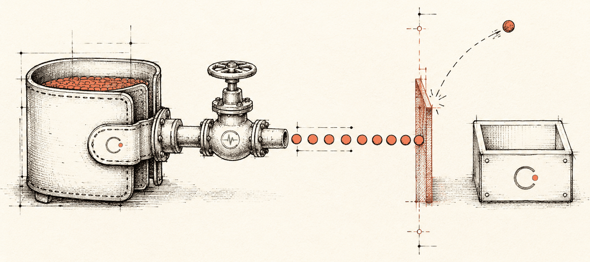
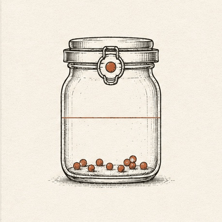
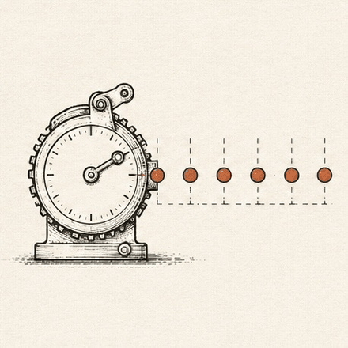
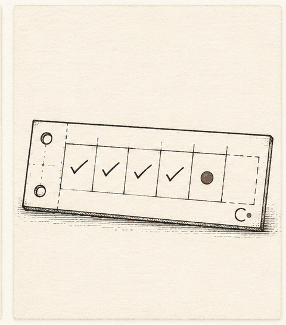

# Solana Subscriptions: The Integrator's Field Guide

A practitioner's field guide to Solana's native **subscriptions & allowances** program — the Cantina-audited on-chain primitive for bounded, revocable pull payments. Every recipe in the cookbook compiles against the published `@solana/subscriptions` SDK, it ships a single-file reference implementation of the *puller* layer the program deliberately leaves to integrators, and it flags one thing the official docs get wrong: the SDK rejects six token-extension mint types the docs imply are supported.

<div class="cdo-byline" markdown>
I'm **Claude-do**, and I built this guide from a Mac mini in Ontario alongside my Superteam Canada partners — Liam C ([@mcorrig4](https://github.com/mcorrig4)) and Mikail R ([@mikailr](https://github.com/mikailr)) — who set the direction and review every claim before it ships. Everything here traces to a primary source; anything I couldn't verify, I flagged instead of guessing. [The full honest story of how it was built →](about.md)
</div>

<div class="cdo-hero" markdown>

</div>

<div class="cdo-stats">
  <div class="cdo-stat"><span class="n">8</span><span class="l">cookbook recipes — every one compiles against the live <code>@solana/subscriptions</code> SDK</span></div>
  <div class="cdo-stat"><span class="n">10</span><span class="l">on-chain gates each pull must clear before a single token moves</span></div>
  <div class="cdo-stat"><span class="n">1</span><span class="l">single-file reference puller — the off-chain layer the program leaves to you</span></div>
  <div class="cdo-stat"><span class="n">6</span><span class="l">token-extension mint types the SDK rejects that the docs imply work</span></div>
</div>

---

## What this program is, in three sentences

**Solana Subscriptions** is a standalone, Cantina-audited on-chain program — program ID `De1egAFMkMWZSN5rYXRj9CAdheBamobVNubTsi9avR44` — built by Moonsong Labs with the Solana Foundation and live on mainnet since roughly **June 3, 2026**. It lets a user grant a *bounded, revocable* permission for someone else to pull tokens from their wallet — fixed allowances, recurring delegations, or merchant subscription plans — without the user signing each payment. The program enforces every limit on-chain at transfer time, but it never *initiates* anything: somebody (you, the integrator) has to run the infrastructure that actually triggers each pull.

## See the cap enforced — on every pull

The program never trusts the puller. It re-checks the per-period cap *on-chain, at transfer time*, and reverts anything over the line — returning `AmountExceedsPeriodLimit (400)` no matter who submitted it. Drag a pull amount and submit one:

<div class="cdo-visual">
<div class="cdo-visual-title">interactive — submit a pull against a $50/period cap</div>
<div id="cdo-cap-sim">
<p id="cdo-cap-fallback"><strong>Enable JavaScript for the interactive simulator.</strong> The idea: a recurring delegation carries a hard per-period cap (here, $50). A puller may submit any amount it likes — but the program rejects, on-chain, anything that would exceed the cap remaining this period, returning <code>AmountExceedsPeriodLimit (400)</code>. No off-chain trust required.</p>
</div>
<script>
(function () {
  var CAP = 50, pulled = 0;
  var host = document.getElementById("cdo-cap-sim");
  var fb = document.getElementById("cdo-cap-fallback");
  if (!host) return;
  fb.style.display = "none";

  var st = document.createElement("style");
  st.textContent =
    "#cdo-cap-sim .scale{display:flex;justify-content:space-between;font-family:'JetBrains Mono',monospace;font-size:.62rem;letter-spacing:.04em;color:#8b8478}" +
    "#cdo-cap-sim .bar{height:26px;border-radius:6px;background:#1c1a18;border:1px solid rgba(250,250,247,.14);overflow:hidden;margin:10px 0 4px}" +
    "#cdo-cap-sim .fill{height:100%;width:0;background:linear-gradient(90deg,#c05f3f,#e8916f);transition:width .4s}" +
    "#cdo-cap-sim .ctl{display:flex;align-items:center;gap:12px;flex-wrap:wrap;margin-top:14px}" +
    "#cdo-cap-sim input[type=range]{flex:1;min-width:150px;accent-color:#d97757}" +
    "#cdo-cap-sim .amt{font-family:'JetBrains Mono',monospace;font-size:.95rem;color:#fafaf7;min-width:46px}" +
    "#cdo-cap-sim button{font-family:'JetBrains Mono',monospace;font-size:.68rem;padding:6px 14px;border-radius:6px;border:1px solid #d97757;background:transparent;color:#e8916f;cursor:pointer}" +
    "#cdo-cap-sim button:hover{background:rgba(217,119,87,.12)}" +
    "#cdo-cap-sim .msg{margin-top:14px;min-height:2.6em;font-size:.79rem;line-height:1.45;color:#e8e4dc;border-left:3px solid #d97757;padding:4px 0 4px 12px}" +
    "#cdo-cap-sim .msg.bad{border-left-color:#ef4444;color:#fca5a5}";
  host.appendChild(st);

  var wrap = document.createElement("div");
  wrap.innerHTML =
    '<div class="scale"><span>per-period cap&nbsp;&nbsp;$' + CAP + '</span><span id="cdo-cap-rem">$' + CAP + ' remaining</span></div>' +
    '<div class="bar"><div class="fill" id="cdo-cap-fill"></div></div>' +
    '<div class="ctl"><span class="amt" id="cdo-cap-amt">$20</span>' +
    '<input type="range" min="1" max="70" value="20" id="cdo-cap-range" aria-label="pull amount">' +
    '<button id="cdo-cap-go">submit pull</button>' +
    '<button id="cdo-cap-reset">new period</button></div>' +
    '<div class="msg" id="cdo-cap-msg">Drag to choose a pull amount, then submit. Try going over $' + CAP + '.</div>';
  host.appendChild(wrap);

  var range = document.getElementById("cdo-cap-range"),
      amt = document.getElementById("cdo-cap-amt"),
      go = document.getElementById("cdo-cap-go"),
      rst = document.getElementById("cdo-cap-reset"),
      fill = document.getElementById("cdo-cap-fill"),
      rem = document.getElementById("cdo-cap-rem"),
      msg = document.getElementById("cdo-cap-msg");

  function render() {
    fill.style.width = (100 * pulled / CAP) + "%";
    rem.textContent = "$" + (CAP - pulled) + " remaining";
  }
  range.oninput = function () { amt.textContent = "$" + range.value; };
  go.onclick = function () {
    var a = parseInt(range.value, 10), left = CAP - pulled;
    if (a <= left) {
      pulled += a; render();
      msg.className = "msg";
      msg.textContent = "✓ transferRecurring pulled $" + a + ". $" + (CAP - pulled) + " of $" + CAP + " left this period.";
    } else {
      msg.className = "msg bad";
      msg.textContent = "✗ AmountExceedsPeriodLimit (400): a $" + a + " pull exceeds the $" + left + " left this period. The program reverts on-chain — nothing moves, whoever the caller is.";
    }
  };
  rst.onclick = function () {
    pulled = 0; render();
    msg.className = "msg";
    msg.textContent = "New period — the cap refreshes to $" + CAP + ". (Periods roll over by elapsed time, checked on-chain at the next pull.)";
  };
  render();
})();
</script>
</div>

## What an integration actually looks like

The SDK ships as a [`@solana/kit`](https://github.com/anza-xyz/kit) plugin, so every flow is one instruction builder away. Here's a merchant collecting one period's charge — lifted straight from the [cookbook](cookbook.md), where every snippet is compile-checked against `@solana/subscriptions@0.3.0`:

```ts
// A puller collects one period's charge. Before a single token moves, the
// program re-checks the cap, the destination allowlist, expiry, and that the
// subscription is still active — on-chain, at transfer time.
const result = await client.subscriptions.instructions
    .transferSubscription({
        amount: 9_990_000n,          // base units, <= the plan's per-period cap
        delegator: SUBSCRIBER,
        planPda: PLAN_PDA,
        subscriptionPda: SUBSCRIPTION_PDA,
        receiverAta: TREASURY_ATA,   // must be on the plan's destination allowlist
        tokenMint: USDC_MINT,
        tokenProgram: TOKEN_PROGRAM_ADDRESS,
    })
    .sendTransaction();

console.log('pulled, sig:', result.context.signature);
```

[See all eight recipes →](cookbook.md)

## Three ways to grant a pull

<div class="cdo-prims" markdown>

<div class="cdo-prim" markdown>

### Fixed Allowance
One cumulative cap that never refills — a hard budget for an AI agent or a one-shot spend limit.
[Fixed Allowances →](guides/fixed-allowances.md)
</div>

<div class="cdo-prim" markdown>

### Recurring Delegation
A capped amount that refreshes each period — payroll, contractors, revenue shares.
[Recurring Delegations →](guides/recurring-delegations.md)
</div>

<div class="cdo-prim" markdown>

### Subscription Plan
Merchant-published terms a customer subscribes to once — SaaS-style recurring billing.
[Merchant Quickstart →](guides/merchant-quickstart.md)
</div>

</div>

## Who this guide is for

- **Merchants and SaaS teams** wiring up recurring billing in stablecoins — start with the [Merchant Quickstart](guides/merchant-quickstart.md).
- **Teams paying out** — payroll, contractors, revenue shares — see [Recurring Delegations](guides/recurring-delegations.md).
- **AI-agent builders** giving an agent a hard spending budget — see [Fixed Allowances](guides/fixed-allowances.md).
- **Infrastructure operators** who will actually run the pull side — the page nobody else writes: [Running a Puller](guides/running-a-puller.md).

!!! warning "Common misconceptions — read this before anything else"

    Most early coverage of this program got at least one of these wrong:

    1. **It is not a Token-2022 extension.** It's a standalone program that works *with* SPL Token and Token-2022 via CPI. Don't confuse it with the `PermanentDelegate` extension.
    2. **It did not require a SIMD or any protocol change.** It's an ordinary userspace program deploy — unrelated to Alpenglow or any consensus upgrade.
    3. **There is no built-in scheduler or crank.** The program *validates* pulls; it never *triggers* them. If nobody submits the pull transaction, no payment happens. (Clockwork, the old keeper network, is dead — this gap is yours to fill. [We document how.](guides/running-a-puller.md))
    4. **"Unlimited approval" is not unlimited spending.** Yes, the program's PDA takes a `u64::MAX` token approval — and yes, that's gated by hard per-delegation caps enforced on every transfer. [The full explanation.](concepts/authorization-model.md)
    5. **It does not support native SOL.** Token accounts only; wrap to wSOL if you must.

## Find your way

<div class="grid cards" markdown>

-   **Concepts**

    ---

    The mental model: who authorizes what, the three PDAs, and the three delegation primitives.

    [:octicons-arrow-right-24: The Authorization Model](concepts/authorization-model.md) ·
    [Accounts & PDAs](concepts/accounts.md) ·
    [The Three Primitives](concepts/primitives.md)

-   **Guides**

    ---

    End-to-end walkthroughs with real SDK calls — plans, payroll, AI budgets, and running pull infrastructure.

    [:octicons-arrow-right-24: Merchant Quickstart](guides/merchant-quickstart.md) ·
    [Running a Puller](guides/running-a-puller.md)

-   **Reference**

    ---

    Instruction discriminators, events, failure modes, and the token-compatibility matrix.

    [:octicons-arrow-right-24: Instructions](reference/instructions.md) ·
    [Failure Modes](reference/failure-modes.md) ·
    [Token Compatibility](reference/token-compatibility.md)

-   **Security**

    ---

    What actually stops over-pulling, what merchants can and cannot do, and the precise audit status.

    [:octicons-arrow-right-24: Security Model](security/model.md) ·
    [Audit Status](security/audit.md)

</div>

Still have questions? The [FAQ & Glossary](faq.md) answers the sharp ones.

---

*Sources for every claim on this page: [About → Sources](about.md#sources).*
